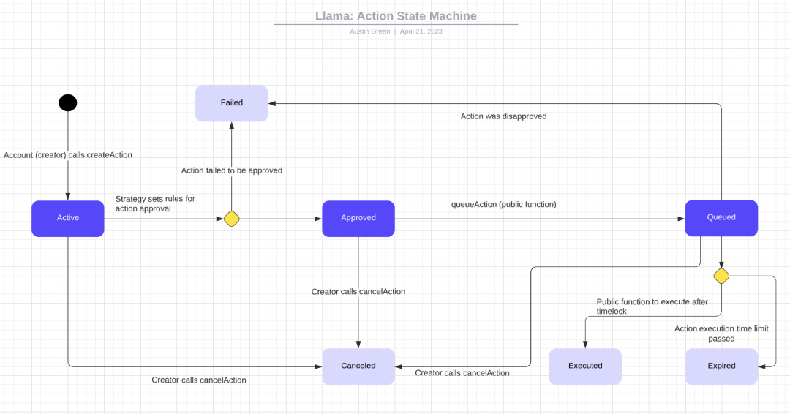

# Action Creation

After your Llama instance is deployed, it's time to start creating actions. Actions are onchain transactions that serve as the exit point for your llama instance to interact with external contracts. Here is the anatomy of an action:

    Action Elements:
    - Target Contract (the contract to be called by the Llama executor)
    - Strategy (the Llama strategy that determines the action state)
    - Calldata (function selector and parameters)
    - Role (role used to create the action)
    - Value (amount of ether sent with the call)
    - Description (plaintext explaining the purpose of the action)


## Key Concepts

    - Actions: Proposals made by policyholders to execute a transaction(s) onchain .
    - Policies: Non-transferable NFTs encoded with roles and permissions for an individual llama instance.
    - Roles: A signifier given to one or more policyholders. Roles can be used to permission action approvals/disapprovals.
    - Permissions: A unique identifier that can be assigned to roles to permission action creation. Permissions are represented as a hash of the target contract, function selector, and strategy contract. Actions cannot be created unless a policyholder holds a role with the correct permission.
    - Strategies: A contract that holds all of the logic to determine action state. For example, strategies determine wheter or not an action is approved/disapproved, canceled, or able to be executed.
    - Executor: The single exit point of a Llama instance. All actions that are executed will be sent from the Llama executor.
    - Guards: Guards enable pre and post action execution saftey checks. Guards can be used to add arbitrary logic checks before and after action execution such as spending limits or calldata permissioning
    - Scripts: Contracts that are delegate called instead of called. Scripts can be used to batch calls together for extended functionality.

## Action State



Action state consists of seven unique states and is represented by the following enum:
```
enum ActionState {
  Active,
  Canceled,
  Failed,
  Approved,
  Queued,
  Expired,
  Executed
}
```

Lets dive into each state and what they mean.
  - Active: The action has been created and policyholders can approve the action. If the action is not approved by the end of the approval period, the action will fail.
  - Canceled: The action creator has the opportunity to cancel the action at any time during the action lifecycle. Once an action has been canceled, it cannot be executed. Reached by sucessfully calling `cancelAction`.
  - Failed: An action reaches the failed state if it does not reach the approval quorum by the end of the approval period, or if the action gets disapproved during the queuing period. Once an action has reached the failed state, it cannot be executed.
  - Approved: The action has reached been approval and is ready to be queued.
  - Queued: The action is in the Queued period for the queueing duration and policyholders are able to disapprove the action. If the action is disaproved it will fail, otherwise it will be able to be executed after the queuing period ends. Reached by sucessfully calling `queueAction`.
  - Expired: The action has passed the queuing period, but was not executed in time. Another way to phrase expiration would be if block.timestamp is greater than Action's executionTime + expirationDelay.
  - Executed: This state signifies that the action has been executed successfully. Reached by sucessfully calling `executeAction`.


We can call the `getActionState` method on `LlamaCore` to get the current state of a given action

## Permissioning Action Creation

Actions are permissioned through Llama policies. Policyholders with the corresponding permissions are able to create actions. policy holders with the correct approval/disapproval roles are able to cast their (dis)approvals on the action, which determines whether or not the action passes or fails. If an action passes, it is able to be executed, otherwise it fails and cannot be executed.