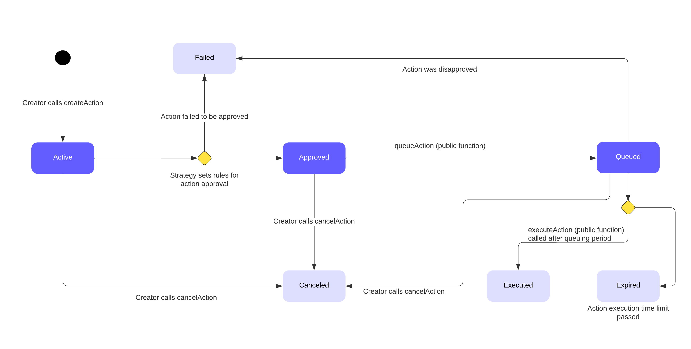

# Action Creation

After your Llama instance is deployed, it's time to start creating actions.
Actions are proposed transactions initiated by policyholders that are executed onchain. 
This may include changing protocol parameters, transferring funds from a treasury, activating an emergency pause, etc. 
Actions are how your Llama instance interacts with external contracts.
Here is the anatomy of an action:

- Target Contract: Contract to be called by the Llama executor.
- Strategy: Contract that determines the rules the action must follow.
- Calldata: Function selector and its parameters.
- Role: Role used to create the action.
- Value: Amount of Ether sent with the call.
- Description: Markdown text explaining the purpose of the action.


## Key Concepts

- Actions: Proposals made by policyholders to execute onchain transactions.
  - Policies: Non-transferable NFTs encoded with roles and permissions for an individual Llama instance.
  - Roles: A signifier that is used to permission action creation, approval, and disapproval. Any role can be given to one or more policyholders.
  - Permissions: A unique identifier that can be assigned to roles to enable action creation. Permissions are represented as a hash of the target contract, function selector, and strategy contract. Actions cannot be created unless a policyholder holds a role with the correct permission.
  - Strategies: A contract that holds all of the logic to determine the rules and state of an action. For example, strategies determine whether or not an action is approved/disapproved, canceled, or able to be executed. They also determine details around who is allowed to cast approvals/disapprovals.
  - Executor: The single exit point of a Llama instance. All actions that are executed will be sent from the Llama executor.
  - Guards: Guards enable pre and post action execution safety checks. Guards can be used to add arbitrary logic checks before and after action execution such as spending limits or calldata permissioning.
  - Scripts: Contracts that are delegate called instead of called. Scripts can be used to batch calls together for extended functionality.

## Action State



Action state consists of seven unique states and is represented by the following enum:
```
enum ActionState {
  Active,
  Canceled,
  Failed,
  Approved,
  Queued,
  Expired,
  Executed
}
```

Lets dive into each state and what they mean.
  - **Active**: The default state after an action has been created. This is when policyholders can approve the action. If the action is not approved by the end of the approval period, the action will fail.
  - **Canceled**: The action creator has the opportunity to cancel the action at any time during the action lifecycle. Once an action has been canceled, it cannot be executed. Reached by successfully calling `cancelAction`.
  - **Failed**: An action reaches the failed state if it does not reach the approval quorum by the end of the approval period, or if the action gets disapproved during the queuing period. Once an action has reached the failed state, it cannot be executed.
  - **Approved**: The action has been approved and is ready to be queued.
  - **Queued**: The action is in the Queued period for the queueing duration and policyholders are able to disapprove the action. If the action is disapproved it will fail, otherwise it will be able to be executed after the queuing period ends. Reached by successfully calling `queueAction`.
  - **Expired**: The action has passed the queuing period, but was not executed in time. Another way to phrase expiration would be if block.timestamp is greater than Action's executionTime + expirationDelay.
  - **Executed**: This state signifies that the action has been executed successfully. Reached by sucessfully calling `executeAction`.


We can call the `getActionState` method on `LlamaCore` to get the current state of a given action.

## Permissioning Action Creation

Permissions are the atomic unit for action creation access control and are managed through the through `LlamaPolicy` contract. 
Permissions can be assigned to roles, and roles are assigned to policies. 
Policies can have many roles, and roles can have many permissions. When creating an action, a validation check is done to make sure that the policyholder has a role with the correct permission.

Permissions are calculated by hashing the `PermissionData` struct, which looks like this:
```
struct PermissionData {
  address target; // Contract being called by an action.
  bytes4 selector; // Selector of the function being called by an action.
  ILlamaStrategy strategy; // Strategy used to govern the action.
}
```

When creating an action, the permission required to create said action can be calculated on the fly, since the action creator must pass in the `target`, `selector` & `strategy`. 
We can calculate the permission id on the spot and check the `canCreateAction` mapping on the LlamaPolicy contract to verify that the action creation role has the corresponding permission.

To add and remove permissions, we use the `setRolePermission` function on the `LlamaPolicy` contract.

Permissions are what enable strategy contracts, since without the right permission, a policyholder would not be able to create an action that uses a different strategy than their permission allows. 
This is important because strategies cannot be explicitly deleted or unauthorized in the Llama system; in order to unauthorize a strategy, we would remove all of the permissions that use that strategy rendering it useless.

## Approvals and Disapprovals

The ability to cast approvals and disapprovals will typically be controlled by roles defined in a `ILlamaStrategy` contract, and are set explicitly on the strategy contract at deployment. 
Each strategy can have exactly one approval role and one disapproval role.
Policy holders with the correct approval/disapproval roles are able to cast their approvals/disapprovals on the action, which determines whether or not the action passes or fails.
Policyholders without the correct approval/disapproval role are not able to cast.

### Force Approval/Disapproval Roles

Strategies have a concept of force approval/disapproval roles in addition to the normal approval/disapproval roles. 
A strategy can have many force approval/disapproval roles, unlike the normal approval/disapproval roles which are limited to one. 
Like the name suggests, if a policyholder with a force role casts their approval/disapproval the strategy will immediately reach the respective quorum.

## Scripts

Scripts are the term used to refer to target contracts that are called via `DELEGATECALL` instead of a normal `CALL`.
The main use-case for scripts is to batch multiple calls together into one action. 
In particular, scripts should be used to batch calls that are regularly made in tandem with one another to perform maintenance or other recurring tasks. 

`DELEGATECALL` is dangerous to use by default, so scripts must be authorized before use. 
To authorize a script, a policyholder must create an action that calls the `authorizeScript` function on `LlamaCore`. 
Scripts may also be unauthorized using the same function.

## Guards

Guards are optional hooks that run at action creation, pre-action execution, and post-action execution. They can be set on any pair of target address and function selector. 
The main use-case for guards is to extend the Llama permissioning system. 
Guards can effectively permission calldata, such as implementing a spending limit per transaction in the `validatePreActionExecution` function, or verifying the final state of a DeFi transaction is as expected in `validatePostActionExecution`.

Guards have one limitation in that they cannot be used to guard calls to the core or policy contract, since a malfunctioning guard could brick your Llama instance if it were able to guard a core function such as `setRolePermission` or `setGuard` itself.

Llama recommends using guards to implement adhoc and protocol specific safety checks.